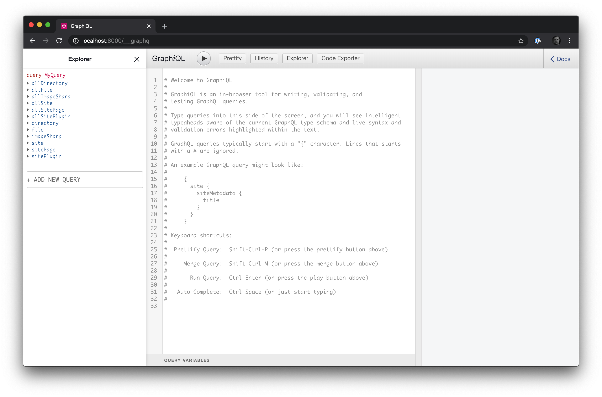
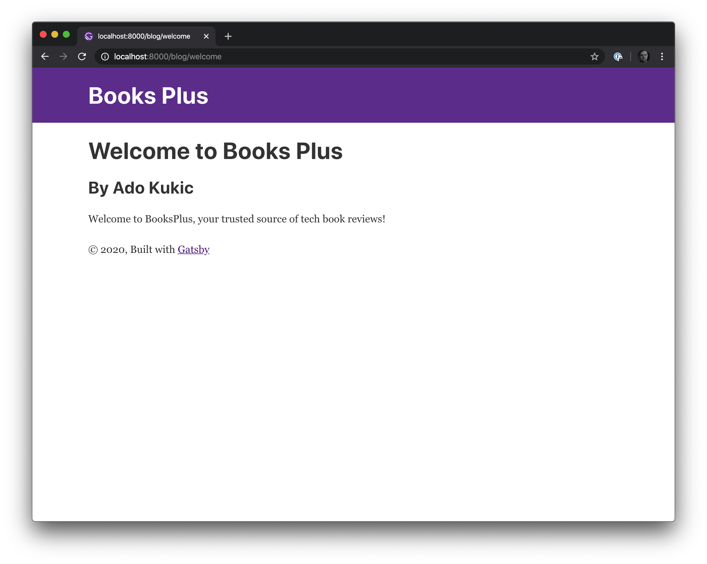

# Build a Modern Blog with Gatsby and MongoDB

The web, like many other industries, works in a very cyclical way. Trends are constantly born and reborn. One of my favorite trends that's making a huge come back is static websites and focus on website performance. GatsbyJS presents a new way of building websites that mergers the static with the dynamic that in my opinion provides a worthwhile framework for your consideration.

In today's tutorial, we're going to take a look at how we can leverage GatsbyJS and MongoDB to build a modern blog that can be served anywhere. We'll dive into how GraphQL makes it easy to visualize and work with our content regardless of where it's coming from. Get the code from this GitHub repo to follow along.

## Prerequisites

For this tutorial you'll need:

* A recent version of Node.js
* A recent version of npm
* MongoDB

You can download Node.js here, and it will come with the latest version of npm. For MongoDB, you can use an existing install or MongoDB Atlas for free. The dataset we'll be working with comes from {Person}, and can be found in this GitHub repo. All other required items will be covered in the article. 

## What We're Building: A Modern Book Review Blog

The app that we are building today is called Books Plus. It is a blog that covers news stories and reviews on technical books.


## Getting Started with GatsbyJS

GatsbyJS is a React based framework for building highly performant websites and applications. The framework allows developers to utilize the modern JavaScript landscape to quickly build static websites. What makes GatsbyJS really stand out is the ecosystem built around it. Plugins for all sorts of features and functionality easily interoperate to provide a powerful toolkit for anything you want your website to do.


The second key feature of GatsbyJS is it's approach to data sources. While most static website generators simply process Markdown files into HTML, GatsbyJS provides a flexible mechanism for working with data from any source. In our article today, we'll utilize this functionality to show how we can have data both in Markdown files as well as in a MongoDB database, and GatsbyJS will handle it all the same.

## Setting Up Our Application

To create a GatsbyJS site, we'll need to install the Gatsby CLI. In your Terminal window run `npm install -g gatsby-cli`.


To confirm that the CLI is properly installed run `gatsby -help` in your Terminal. You'll see a list of available commands such as **gatsby build** and **gatsby new**. If you see information similar to the screenshot above, you are good to go.

The next step will be to create a new GatsbyJS website. There's a couple of different ways we can do this. We can start with a barebones GatsbyJS app or a starter app that has various plugins already installed. To keep things simple we'll opt for the former. To create a new barebones GatsbyJS website run the following command:

```bash
gatsby new booksplus
```

Executing this command in your Terminal will create a new barebones GatsbyJS application in a directory called `booksplus`. Once the installation is complete, navigate to this new directory by running `cd booksplus` and once in this directory let's start up our local GatsbyJS development server. To do this we'll run the following command in our Terminal window.

```bash
gatsby develop
```

This command will take a couple of seconds to execute, but once it has, you'll be able to navigate to `localhost:8080` to see the default GatsbyJS starter page. 


The default page is not very impressive, but seeing it tells us that we are on the right path. You can also click the **Go to page 2** hyperlink to see how Gatsby handles navigation.

## GatsbyJS Secret Sauce: GraphQL

If you were paying attention to your Terminal window while GatsbyJS was building and starting up the development server you may have also noticed a message saying that you can navigate to `localhost:8000/___graphql` to explore your site's data and schema. Good eye! If you haven't, that's ok, let's navigate to this page as well and make sure that it loads and works correctly. 



GraphiQl is a powerful user interface for working with GraphQL schemas, which is what GatsbyJS generates for us when we run `gatsby develop`. All of our websites content, including pages, images, components, and so on become queryable. This API is automatically generated by Gatsby's build system, we just have to learn how to use it to our advantage.

If we look at the **Explorer** tab in the GraphiQL interface, we'll see the main queries for our API. Let's run a simple query to see what our current content looks like. The query we'll run is:

```
query MyQuery {
  allSitePage {
    totalCount
  }
}
```

Running this query will return the total number of pages our website currently has which is 5. 


We can add on to this query to return the path of all the pages. This query will look like the following:

```
query MyQuery {
  allSitePage {
    totalCount
    nodes {
      path
    }
  }
}
```

And the result:


The great thing about GraphQL and GraphiQL is that it's really easy to build powerful queries. You can use the explorer to see what fields you can get back. Covering all the ins and outs of GraphQL is out of the scope of this article, but if you are interested in learning more about GraphQL check out this crash course that will get you writing pro queries in no time.

Now that we have our app set up, let's get to building our application.

## Adding Content To Our Blog

A blog isn't very useful without content. Our blog reviews books. So the first thing we'll do is get some books to review. New books are constantly being released, so I don't think it would be wise to try and keep track of our books within our GatsbyJS site. A database like MongoDB on the other hand makes sense. [Hakan Özler]() has a curated list of datasets for MongoDB and one of them just happens to be a list of 400+ books. Let's use this dataset.

I will import the dataset into my database that resides on MongoDB Atlas. If you don't already have MongoDB installed, you can get a free account on MongoDB Atlas. Additionally, if you'd like to evaluate MongoDB Atlas's premium features you can use the code **ADO200** for a $200 credit.

In my MongoDB Atlas cluster, I will create a new database and call it `gatsby`. In this new database, I will create a collection called `books`. There are many different ways to import data into your MongoDB database, but since I'm using MongoDB Atlas, I'll just import it directly via the web user interface.


Our sample dataset contains 431 books, so after the import we should see 431 documents in the books collection.

## Connecting MongoDB and GatsbyJS

Now that we have our data, let's use it in our GatsbyJS application. To use MongoDB as a data source for our app, we'll need to install the `gatsby-source-mongodb` plug in. Do so by running

```bash
npm install --save gatsby-source-mongodb
```

in your Terminal window. With the plugin installed, the next step will be to configure it. Open up the `gatsby-config.js` file. This file contains our site metadata as well as plugin configuration options. In the `plugins` array, let's add the `gatsby-source-mongodb` plugin. It will look something like this:

```js
{
    // The name of the plugin
    resolve: `gatsby-source-mongodb`,
    options: {
        // Name of the database and collection where are books reside
        dbName: `gatsby`,
        collection: 'books',
        server: {
            address: 'main-shard-00-01-zxsxp.mongodb.net',
            port: 27017
        },
        auth: {
            user: 'ado',
            password: 'password'
        },
        extraParams: {
            replicaSet: 'Main-shard-0',
            ssl: true,
            authSource: `admin`,
            retryWrites: true
        }
    }
},
```

Save the file. If your `dbName` and `collection` are different from the above, take note of them as the naming here is very important and will determine how you interact with the GraphQL API.

If your GatsbyJS website is still running, stop it, run `gatsby clean` and then `gatsby develop` to restart the server. The `gatsby clean` command will clear the cache and delete the previous version. In my experience, it is recommended to run this as otherwise you may run into issues with the server restarting correctly.

When the `gatsby develop` command has successfully been re-run, navigate to the GraphiQL UI and you should see two new queries available: `mongodbGatsbyBooks` and `allMongodbGatsbyBooks`. Please note that if you named your database and collection something different, then these query names will be different. The convention they will follow though will be `mongodb<Your-Database-Name><Your-CollectionName>` and `allMongodb<Your-Database-Name><Your-CollectionName>`.

Let's play with one of these queries and see what data we have access to. Execute the following query in GraphiQL:

```
query MyQuery {
  allMongodbGatsbyBooks {
    edges {
      node {
        title
      }
    }
  }
}
```

Your result will look something like this:


Excellent. Our plugin was configured successfully and we see our collection data in our GatsbyJS website. We can add on to this query by requesting additional parameters like the authors, categories, description and so on, but rather than do that here, why don't we render it in our website.

## Displaying Book Data On the Homepage

We want to display the book catalog on our homepage. Let's open up the `index.js` page located in the `src/pages` directory. This React component represent our homepage. Let's clean it up a bit before we start adding additional styles. Our new barebones component will look like this:

```js
import React from "react"
import { Link } from "gatsby"

import Layout from "../components/layout"

const IndexPage = () => (
  <Layout>
    <div className="book-container">

    </div>
  </Layout>
)

export default IndexPage
```

Next let's add a GraphQL query to get our books data into this page. The updated code will look like this:

```js
import React from "react"
import { Link } from "gatsby"
import { graphql } from "gatsby"

import Layout from "../components/layout"

const IndexPage = () => (
  <Layout>
    <div className="book-container">

    </div>
  </Layout>
)

export default IndexPage

export const pageQuery = graphql`
  query {
    allMongodbGatsbyBooks {
      edges {
        node {
          id
          title
          shortDescription
          thumbnailUrl
        }
      }
    }
  }
`
```

We are making a call to the `allMongodbGatsbyBooks` query and asking for all the books in the collection. For each book we want to get it's id, title, shortDescription and thumbnailUrl. Finally, to get this data into our component, we'll pass it through props:

```js
import React from "react"
import { Link } from "gatsby"
import { graphql } from "gatsby"

import Layout from "../components/layout"

const IndexPage = (props) => {
  const books = props.data.allMongodbGatsbyBooks.edges;

  return (
    <Layout>
      <div className="book-container">

      </div>

    </Layout>
  )
}

export default IndexPage

export const pageQuery = graphql`
  query {
    allMongodbGatsbyBooks {
      edges {
        node {
          id
          title
          shortDescription
          thumbnailUrl
        }
      }
    }
  }
`
```

Now we can render our books to the page. We'll do so by iterating over the books array and displaying all of the information we requested. The code will look like this:

```js
  return (
    <Layout>
      <div className="book-container">
        {books.map(book =>
            <div className="book">
                <Link to={'/book/' + book.node.id}>
                    
                    <h2>{book.node.title}</h2>
                    <p>{book.node.shortDescription}</p>
                </Link>
            </div>
        )}
      </div>
    </Layout>
  )
```

Let's go to `localhost:8000` and see what our website looks like now. It should look something like: 


If you start scrolling you'll notice that all 400+ books were rendered on the page. All this data was cached so it will load very quickly. But if we click on any of the links, we will get a 404. That's not good, but there is a good reason for it. We haven't created an individual view for the books. We'll do that shortly. The other issue you might have noticed is that we added the classes `book-container` and `book` but they don't seem to have applied any sort of styling. Let's fix that issue first. 

Open up the `layout.css` file located in the `src/components` directory and add the following styles to the bottom of the page:

```css
.book-container {
  display: flex;
  flex-direction: row;
  flex-wrap: wrap
}

.book {
  width: 25%;
  flex-grow: 1;
  text-align: center;
}

.book img {
  width: 50%;
}
```

Next, let's simplify our UI by just displaying the cover of the book. If a user wants to learn more about it, they can click into it. Update the `index.js` return to the following:

```js
const IndexPage = (props) => {
  const books = props.data.allMongodbGatsbyBooks.edges;

  return (
    <Layout>

      <div className="book-container">
      {books.map(book =>
            <div className="book">
              {book.node.thumbnailUrl &&
                <Link to={'/book/' + book.node.id}>
                    
                </Link>
              }
            </div>
      )}
      </div>

    </Layout>
  )
}
```

While we're at it, let's change the name of our site in the header to Books Plus by editing the `gatsby-config.js` file. Update the `siteMetadata.title` property to **Books Plus**.

Our updated UI will look like this:


## Creating the Books Info Page

As mentioned earlier, if you click on any of the book covers you will be taken to a 404 page. GatsbyJS gives us multiple ways to tackle how we want to create this page. We can get this content dynamically, but I think pre-rendering all of this pages at build time will give our users a much better experience, so we'll do that.

The first thing we'll need to do is create the UI for what our single book view page is going to look like. Create a new file in the components directory and call it `book.js`. The code for this file will look like this:

```js
import React from "react"
import { graphql } from "gatsby"
import Layout from "./layout"

class Item extends React.Component {
  render() {
    const book = this.props.data.mongodbGatsbyBooks

    return (
      <Layout>
        <div>
          
          <h1>{book.title}</h1>
          <p>By {book.authors.map(author => ( <span>{author}, </span>))}</p>
          <p>{book.longDescription}</p>
          <p>Published: {book.publishedDate} | ISBN: {book.isbn}</p>
          {book.categories.map(category => category)}
        </div>
      </Layout>
    )
  }
}

export default Item

export const pageQuery = graphql`
  query($id: String!) {
    mongodbGatsbyBooks(id: { eq: $id }) {
      id
      title
      longDescription
      thumbnailUrl
      isbn
      pageCount
      publishedDate(formatString: "MMMM DD, YYYY")
      authors
      categories
    }
  }
`
```

To break down what is going on in this component, we are making use of the `mongodbGatsbyBooks` query which returns information requested on a single book based on the `id` provided. That'll do it for our component implementation. Now let's get to the fun part.

Essentially what we want to happen when we start up our Gatsby server is to go and get all the book information from our MongoDB database and create a local page for each document. To do this, let's open up the `gatsby-node.js` file. Add the following code and I'll explain it below:

```js
const path = require(`path`)

exports.createPages = async ({ graphql, actions }) => {
  const { createPage } = actions

  const { data } = await graphql(`
    {
      books: allMongodbGatsbyBooks {
        edges {
          node {
            id
          }
        }
      }
    }
  `)

  const pageTemplate = path.resolve(`./src/components/book.js`)

  for (const { node } of data.books.edges) {
    createPage({
      path: `/book/${node.id}/`,
      component: pageTemplate,
      context: {
        id: node.id,
      },
    })
  }
}
```

The above code will do the heavy lifting of going through our list of 400+ books and creating a static page for each one. It does this by utilizing the Gatsby `createPages` API. We supply the pages we want, alongside the UI component to use, as well as the path and context for each, and GatsbyJS does the rest. Let's save this file, run `gatsby clean` and `gatsby develop`, and navigate to `localhost:8000`.

Now when the page loads, you should be able to click on any of the books and instead of seeing a 404, you'll see the details of the book rendered at the `/book/{id}` url. 


So far so good! 

## Writing Book Reviews with Markdown

We've shown how we can use MongoDB as a data source for our books. The next step will be to allow us to write reviews on these books and to accomplish that we'll use a different data source: trusty old Markdown.

In the `src` directory, create a new directory and call it `content`. In this directory, let's create our first post called `welcome.md`. Open up the new `welcome.md` file and paste the following markdown:

```markdown
---
title: Welcome to Books Plus
author: Ado Kukic
slug: welcome
---

Welcome to BooksPlus, your trusted source of tech book reviews!
```

Save this file. To use Markdown files as our source of content, we'll have to add another plugin. This plugin will be used to transform our .md files into digestible content for our GraphQL API as well as ultimately our frontend. This plugin is called `gatsby-transformer-remark` and you can install it by running `npm install --save gatsby-transformer-remark`.

We'll have to configure this plugin in our `gatsby-config.js` file. Open it up and make the following changes:

```js
{
    resolve: `gatsby-source-filesystem`,
    options: {
    name: `content`,
    path: `${__dirname}/src/content/`,
    },
},
'gatsby-transformer-remark',
```

The `gatsby-source-filesystem` plugin is already installed, and we'll overwrite it to just focus on our markdown files. Below it we'll add our new plugin to transform our Markdown into a format our GraphQL API can work with. While we're at it we can also remove the `image.js` and `seo.js` starter components as we will not be using them in our application.

Let's restart our Gatsby server and navigate to the GraphiQL UI. We'll see two new queries added: `allMarkdownRemark` and `markdownRemark`. These queries will allow us to query our markdown content. Let's execute the following query:

```
query MyQuery {
  allMarkdownRemark {
    edges {
      node {
        frontmatter {
          title
          author
        }
        html
      }
    }
  }
}
```

Our result should look something like the screenshot below, and will look exactly like the markdown file we created earlier.


## Rendering Our Blog Content

Now that we can query our markdown content, we can just as pre-generate the markdown pages for our blog. Let's do that next. The first thing we'll need is a template for our blog. To create it, create a new file called `blog.js` located in the `src/components` directory. My code will look like this:

```js
import React from "react"
import { graphql } from "gatsby"
import Layout from "./layout"

class Blog extends React.Component {
  render() {
    const post = this.props.data.markdownRemark

    return (
      <Layout>
        <div>
          <h1>{post.frontmatter.title}</h1>
          <h2>By {post.frontmatter.author}</h2>
          <div
          className="blog-post-content"
          dangerouslySetInnerHTML={{ __html: post.html }}
        />
        </div>
      </Layout>
    )
  }
}

export default Blog

export const pageQuery = graphql`
  query($id: String!) {
    markdownRemark(frontmatter : {slug: { eq: $id }}) {
      frontmatter { 
          title
          author
      }
      html
    }
  }
`
```

 Next we'll need to tell Gatsby to build our markdown pages at build time. We'll open the `gatsby-node.js` file and make the following changes:

```js
const path = require(`path`)

exports.createPages = async ({ graphql, actions }) => {
  const { createPage } = actions

  const { data } = await graphql(`
    {
      books: allMongodbGatsbyBooks {
        edges {
          node {
            id
          }
        }
      }
      posts: allMarkdownRemark {
        edges {
          node {
            frontmatter {
              slug
            }
          }
        }
      }
    }
  `)

  const blogTemplate = path.resolve(`./src/components/blog.js`)
  const pageTemplate = path.resolve(`./src/components/book.js`)

  for (const { node } of data.posts.edges) {

    createPage({
      path: `/blog/${node.frontmatter.slug}/`,
      component: blogTemplate,
      context: {
        id: node.frontmatter.slug
      },
    })
  }
  
  for (const { node } of data.books.edges) {
    createPage({
      path: `/book/${node.id}/`,
      component: pageTemplate,
      context: {
        id: node.id,
      },
    })
  }
}
```

The changes we made above will not only generate a different page for each book, but will now generate a unique page for every markdown file. Instead of using a randomly generate id for the content page, we'll use the user-defined slug in the frontmatter.

Let's rebuild our gatsby server and navigate to `localhost:8000/blog/welcome` to see our changes in action.



## Displaying Posts on the Homepage

We want our users to be able to read our content and reviews. Currently you can navigate to `/blog/welcome` to see the post, but it'd be nice to display our latest blog posts on the homepage as well. To do this we'll, make a couple of updates on our `index.js` file. We'll make the following changes:

```js
import React from "react"
import { Link } from "gatsby"
import { graphql } from "gatsby"

import Layout from "../components/layout"

const IndexPage = (props) => {
  const books = props.data.books.edges;
  const posts = props.data.posts.edges;

  return (
    <Layout>
      <div className="posts">
        {posts.map(post =>
          <div className="post">
            <h2><Link to={"/blog/" + post.node.frontmatter.slug}>{post.node.frontmatter.title}</Link></h2>
            <p>By {post.node.frontmatter.author}</p>
          </div>)}
      </div>
      <div className="book-container">
      {books.map(book =>
            <div className="book">
              {book.node.thumbnailUrl &&
                <Link to={'/book/' + book.node.id}>
                    
                </Link>
              }
            </div>
      )}
      </div>

    </Layout>
  )
}

export default IndexPage

export const pageQuery = graphql`
  query {
    posts: allMarkdownRemark {
      edges {
        node {
          frontmatter {
            title
            slug
            author
          }
        }
      }
    }
    books: allMongodbGatsbyBooks {
      edges {
        node {
          id
          title
          shortDescription
          thumbnailUrl
        }
      }
    }
  }
`
```

We've updated our GraphQL query to get us not only the list of books, but also all of our posts. We named these queries `books` and `posts` accordingly so that it's easier to work with them in our template. Finally we updated the template to render the new UI. If you navigate to `localhost:8000` now you should see your latest post at the top like this:


And of course, you can click it to view the single blog post.

## Combining Mongo and Markdown Data Sources

The final thing I would like to do in our blog today is the ability to reference a book from MongoDB in our review. This way when a user reads a review, they can easily click through and see the book information.

To get started with this, we'll need to update our `gatsby-node.js` file to allow us to query a specific book provided in the frontmatter of a post. We'll update the `allMarkdownRemark` so that in addition to getting the slug, we'll get the book parameter. The query will look like this:

```js
allMarkdownRemark {
    edges {
        node {
        frontmatter {
            slug
            book
        }
        }
    }
    }
    ...
}
```

Additionally, we'll need to update our `createPage()` method when generating the blog pages, to pass along the book information in the context.

```js
createPage({
      path: `/blog/${node.frontmatter.slug}/`,
      component: blogTemplate,
      context: {
        id: node.frontmatter.slug,
        book: node.frontmatter.book
      },
    })
  }
```

We'll be able to use anything passed in this `context` property in our GrpahQL queries in our blog component.

Next, we'll update our blog component to account for the new query. This query will be the MongoDB based book query. It will look like so:

```js
export const pageQuery = graphql`
  query($id: String!, $book: String) {
    post: markdownRemark(frontmatter : {slug: { eq: $id }}) {
      id
      frontmatter {
          title
          author
      }
      html
    }
    book: mongodbGatsbyBooks(id: { eq: $book }) {
        id
        thumbnailUrl
      }
    }
`
```

Notice that the `$book` parameter is optional. This means that a post could be associated with a specific book, but it doesn't have to be. We'll update our UI to display the book information if a book is provided.

```js
class Blog extends React.Component {
  render() {
    const post = this.props.data.post
    const book = this.props.data.book

    return (
      <Layout>
        <div>
          <h1>{post.frontmatter.title}</h1>
          <h2>By {post.frontmatter.author}</h2>
          <div
          className="blog-post-content"
          dangerouslySetInnerHTML={{ __html: post.html }}
        />

        {book && 
        <Link to={"/book/" + book.id}>
            
        </Link>
        }
        </div>
      </Layout>
    )
  }
}
```

If we look at our original post, it doesn't have a book associated with it, so that specific post shouldn't look any different. But let's write a new piece of content, that does contain a review of a specific book. Create a new markdown file called `mongodb-in-action-review.md`. We'll add the following review:

```md
---
title: MongoDB In Action Book Review
author: Ado Kukic
slug: mdb-in-action-review
book: 30e4050a-da76-5c08-a52c-725b4410e69b
---

MongoDB in Action is an essential read for anybody wishing to learn the ins and outs of MongoDB. Although the book has been out for quite some time, it still has a lot of valuable information and is a great start to learning MongoDB.
```

Restart your Gatsby server so that the new content can be generated. On your homepage, you'll now see two blog posts, the original **Welcome** post as well as the new **MongoDB In Action Review** post.


Clicking the **MongoDB In Action Review** link will take you to a blog page that contains the review we wrote a few seconds ago. But now, you'll also see the thumbnail of the book. Clicking this thumbnail will lead you to the books page where you can learn more about the book.

## Putting It All Together

In this tutorial, I showed you how to build a modern blog with GatsbyJS. We used multiple data sources, including a remote MongoDB Atlas database and local markdown files, to generate a static blog. We took a brief tour of GraphQL and how it enhances our development experience by consolidating all of our data sources into a single API that we can query both at build and run time. I hope you learned something new, if you have any questions feel free to ask in our MongoDB community forums.

If you want to get the code for this tutorial, you can clone it from this GitHub repo. The sample books dataset can also be found here. Try MongoDB Atlas to make it easy to manage and scale your MongoDB database and use code **ADO200** for a $200 credit. 

Happy coding!